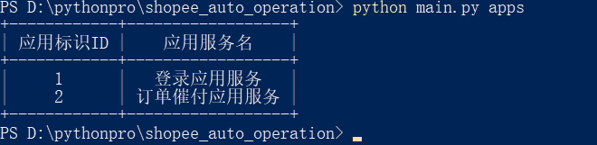
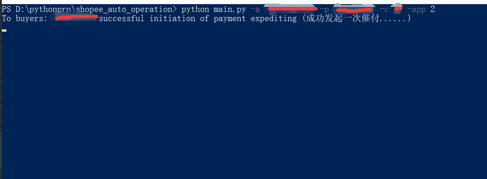
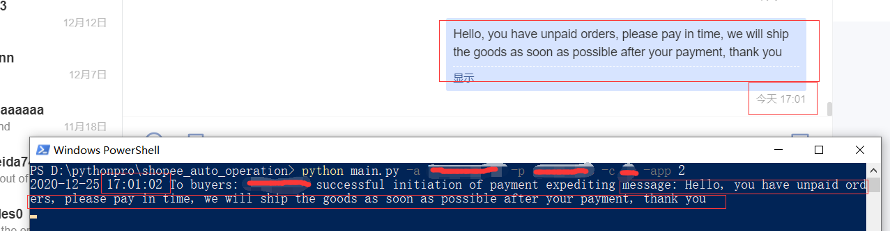

### Shopee Auto Operation(虾皮自动化操作应用)
 Shopee运营自动化工具,命令行方式运行;

 Automation tool based on Shopee API using command line

### Runtime Environment(运行环境)
Python  >= 3.5.1 Version

### Application Directory Structure(应用目录结构描述)
```
├── Readme.md                   // help 

├── main.py                     // (entry file)入口文件

├── config                      // (config module)配置模块

│   ├── __init__.py             // (config module package file)配置模块包文件

│   ├── config.py               // (base config)基础配置

├── database                    // (operation database module)操作数据库模块

│   ├── __init__.py             // (config module package file)配置模块包文件

│   ├── redis.py                // (get redis operation object)获取redis操作实例

│   ├── mongodb.py              // (get mongodb operation object)获取mongodb操作实例

├── init                        // (init application)初始化应用环境

│   ├── __init__.py             // (init module package file)配置模块包文件

│   ├── load_builtin.py         // (load global resources)加载全局内置资源

│   ├── load_env.py             // (load environment)加载环境变量

│   ├── load_log.py             // (load log)加载日志

├── libs                        // (application running support file)应用运行支持文件

├── scripts                     // (application service module)应用服务模块

│   ├── __init__.py             // (application module package file)应用模块包文件

│   ├── script_expediting.py    // (expediting application service)催付应用服务

│   ├── script_login.py         // (login application service)登录应用服务

├── shopee_store_api            // (shopee get resource api module)shopee请求数据资源api模块

│   ├── __init__.py             // (shopee_store_api module package file)shopee请求数据资源api模块包文件

├── helper_functions.py         // (helper functions)助手函数,自动初始化到内置函数当中,直接调用

├── .env.demo                   // (environment variable file demo)应用环境变量模板

├── requirements.txt            // (Python dependency package list)python依赖包列表

```
### Usage Explain(使用说明)
* CLI Parameter:

|   Parameter1  | Parameter2 | Explain |
|  ----  | ----  | ----  |
| --account  | -a  | Account(账号)  |
| --password  | -p | Password(密码)  |
| --country  | -c | Country(国家站点)  |
| --accounts  | -as | Multiple Account(多个账号信息)  |
| --other  | -other | Other Info(其他信息)  |
| --application  | -app | Identification Of The Application To Be Executed(需要执行的应用标识)  |
| apps  | apps | View Application List(查看应用列表)  |

Demos:

Demo1 name：<font size=2 >View Application List (查看应用列表)</font>

cli command (执行命令参数): python main.py apps



Demo2 name：<font size=2 >Unpaid Order Expediting (未付款订单催付)</font>

cli command (执行命令参数): python main.py -a account -p password -c country -app 2




### ADD Custom Application(添加自定义应用)
中文:

所有应用都应当存在scripts模块中,每个应用必须要继承实现scripts模块包(__init__.py)文件中BaseScriptApplication
基类并在__init__.py中引入,给你的应用做好标识ID和备注名这样可以在应用列表中方便找到你的应用,
每个应用的入口函数都是run方法; 注:每个应用都应是一个独立的py文件,如果一个应用需要多个py文件,建议将这个应用以module
包(package)的方式存在scripts模块中.


English:

All applications should exist in scripts module, and each application must inherit and implement scripts module package 
(__ init__ . py) file BaseScriptApplication
Base class and in__ init__ . py, and give your application a good Id and note name, so that you can easily find your application in the application list,
The entry function of each application is run method. Note: each application should be an independent py file. If an application needs multiple py files, it is recommended to use ()
Packages are stored in scripts module.

### PS:

有关详情信息, 请参考源码 !

Please see the source code for details Thank You !
  


